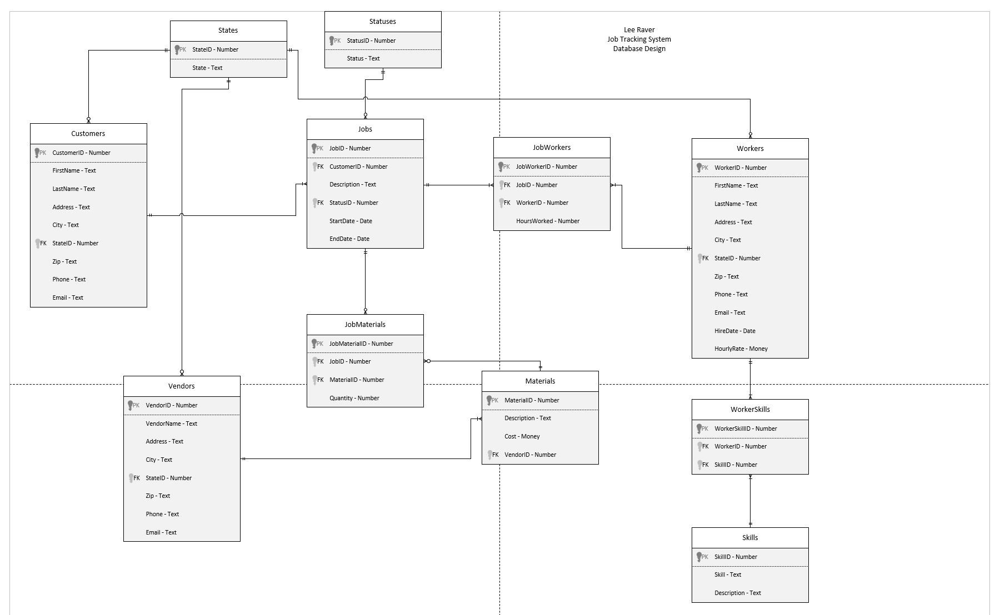
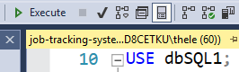
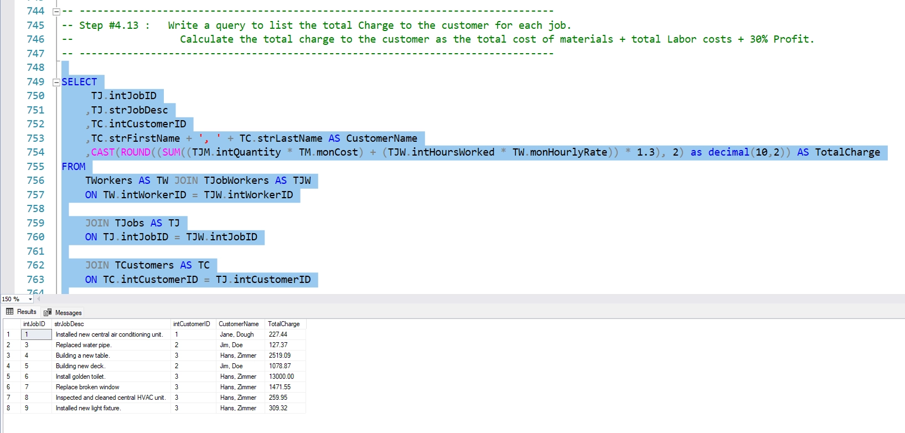

# SQL Job Tracking System Database & Queries

This is a database for a job tracking system designed and built for service professionals such as plumbers, electricians, HVAC, etc.  It keeps track of jobs, their current status, customers, materials, vendors, hours worked, employee information, and more.

## Technology
SQL, Microsoft SQL Server Management Studio

## Setup Instructions
To run the app, first install Microsoft SQL Server Management Studio.

Next, download the job-tracking-system-database.sql file from GitHub.

Open SQL Server Management Studio and select or set up a test database. Name the database dbSQL1, or alternatively change the name at the top of the .sql file to the name of your database: "USE dbSQL1".

Open SQL Server Management Studio and select File > Open > File and select the job-tracking-system-database.sql file. If necessary, rename the database in the file to the name of your database environment.

Click the green Execute button at the top to run the script and create the database.

Press Ctrl + R to clear any query results or popups.

You can run specific snippets of code or queries by highlighting it with your mouse and then hitting execute while it's highlighted.

## Running the Program

Clicking the Execute button while nothing is highlighted will create the database.

It will also execute all the queries and display the results. You can press Ctrl + R to clear the results.

You can selectively highlight certain queris and then press the Execute button to see the results for just that query.

## Design

The job-tracking-system-design.vsdx file shows the full database design, all the relationships, and the attributes of each entity. It has been normalized to Third Normal Form.

## Takeaways
This project allowed me to practice designing a database from scratch based on some requirements, and to normalize it to Third Normal Form. I've found that crafting the perfect query that returns exactly the data you were looking for can be quite satisfying.